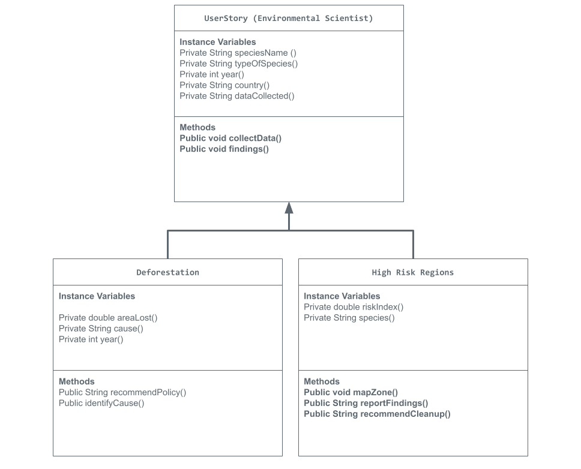

# Unit 2 - Data for Social Good Project

## Introduction

Software engineers develop programs to work with data and provide information to a user. Each user has different needs based on the information they are looking for from data. Your goal is to create a data analysis program for your user that stores and analyzes data to provide the information they need.

## Requirements

Use your knowledge of object-oriented programming, one-dimensional (1D) arrays, and algorithms to create your data analysis program:
- **Write a class** – Write a class to represent your user or business and store and analyze their data with no-argument and parameterized constructors.
- **Create at least two 1D arrays** – Create at least two 1D arrays to store the data that your user needs information about.
- **Write a method** – Write a method that finds or manipulates the elements in a 1D array to provide the information your user needs.
- **Implement a toString() method** – Write a toString() method that returns general information about the data (for example, number of values in the dataset).
- **Document your code** – Use comments to explain the purpose of the methods and code segments and note any preconditions and postconditions.

## User Story  

As an environmental data scientist, I want to develop something that can identify deforestation and high risk regions, so that I can benefit nature and improve biodiversity.

## Dataset 
https://www.kaggle.com/datasets/mexwell/species-protection-dataset
 

- **Species** (String) - name of the species 
- **Year** (int) - year it was endangered
- **Dangers** (String) - Dangers the species is in
- **Values** (int) - species value

## UML Diagram 

 

## Description 

For my project, I created a data analysis program that reads information from four text files and organizes it using a  class called UserStory. The program stores species names, the year they were discovered, the dangers they face, and a numerical “value” representing how dangerous they are. Using this data, the class can analyze the arrays and identify which species has the highest danger value.

In the DataRunner class, I load the data from the files and print out a summary that includes the total number of species, the most dangerous one, and a full list of all the information. This project uses, 1D arrays, constructors, and file-reading methods to display the data in a clear way